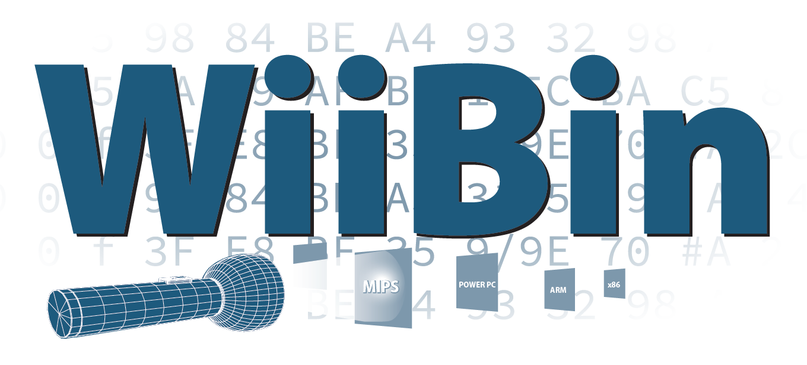
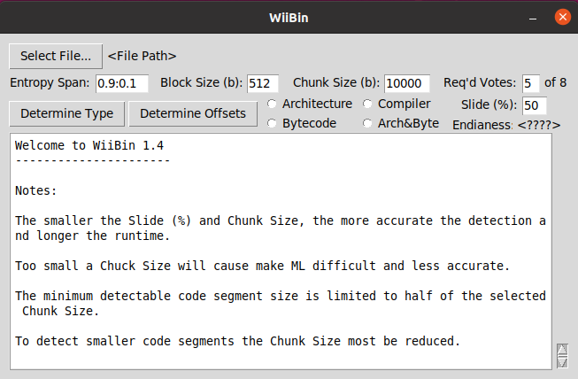
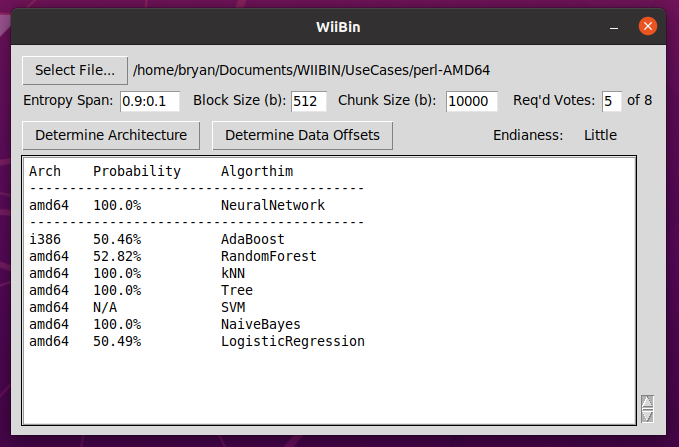
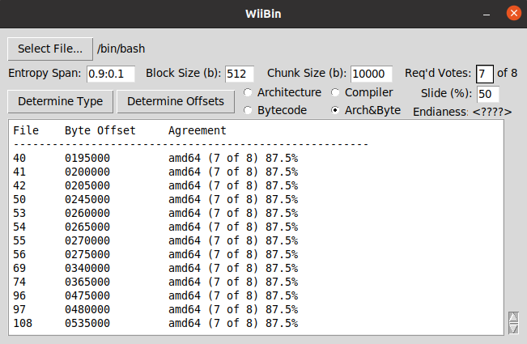
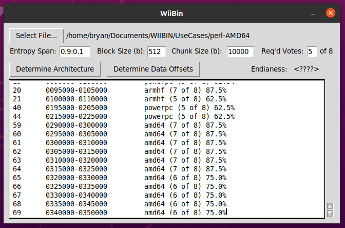

# WiiBin Users Guide

Copyright 2020 Battelle Energy Alliance, LLC, ALL RIGHTS RESERVED

## Note

WiiBin was developed and tested on a Linux system using Python 3.7.7, yet should be platform agnostic and should also work with MacOS and Windows machines. This has not been thoroughly tested.

## Installation

### Python

WiiBin requires the use of Python 3.7.x or Higher. For whatever operating system you are on,
ensure that Python 3.7.x or Higher is installed and accessible through your PATH.

To check that his is correctly functioning run:

```bash
python --version
```

If the version is incorrect, fix it.  To manage python environments, Pyenv is recommended: https://github.com/pyenv/pyenv

### Download Zip

Download WiiBin.zip

Extract the contents of WiiBin.zip into a folder of your choice. 

### Download Via GIT

```bash
git http.sslVerify=false clone --recurse-submodules https://134.20.14.19/fit/wiibin.git
cd wiibin
```

### Dependencies Using Poetry

#### Installing Poetry

##### Windows Powershell

```Powershell
(Invoke-WebRequest -Uri https://raw.githubusercontent.com/python-poetry/poetry/master/get-poetry.py -UseBasicParsing).Content | python
```

##### Linux Bash

```bash
sudo apt install curl
curl -sSL https://raw.githubusercontent.com/python-poetry/poetry/master/get-poetry.py | python
```

#### Installing Dependencies

- numpy (1.18.5) (for numerical processing)
- pandas (1.0.4) (for data handling)
- sklearn (0.22.1) (for machine learning)
- binwalk (tool for walking a binary tree)
- matplotlib (3.1.2) (if showPlots variable is true, a graph will be displayed)

 Notes: 
 - The Binwalk repository will be accessible if wiibin was cloned from git with the above command, otherwise it will need to be installed from source following instructions on Github: https://github.com/ReFirmLabs/binwalk
 - The Python tkinter package comes default on MacOS and Windows Python binaries. If you're on a Debian distribution, run `sudo apt install python3-tk` to install.

Issuing the following commands from WiiBin root directory will install the dependencies :

```bash
poetry shell
poetry install
cd binwalk
sudo python setup.py install
cd ../
```


## Usage

WiiBin is launched from the command line using the following command: 

```bash
python3 WiiBin.py
```

Once launch you are greeted with following interface.



Click *Select File...* to generate a file open dialog and select the binary of interest.

Adjust the default values if desired.

- Entropy Span: The entropy filter to use when generating a byte histogram <Max>:<Min>

- Block Size: The block size in bytes which Binwalk will consider when generating a byte histogram

- Chunk Size: The size in bytes for each portion of the target binary to be split into. 50% overlap is    automatically used. Only used when *Determine Data Offsets* is chosen.
- Req'd Votes: The number of algorithms that must agree on the input binaries architecture in order for results to be output.
- Endianess: Displays the calculated endianess of the binary. Note: Endianness field will only be populated when Determine Architecture is used.

Note: Clicking on the field labels in the GUI will display similar helps and definitions.

Click *Determine Architecture* or *Determine Data Offsets* to begin processing selected file.

Processing status will be seen in the command line window which originally launched WiiBin.py

Once processing is complete, results will be shown on the WiiBin GUI text field.


*Determine Architecture* selected and processed:



Predicted Architecture for each Algorithm is displayed along with the probability of the prediction.  Note: Previous analysis has showed that the NeuralNetwork Algorithm was the most consistently correct and as such is highlighted in the output as seen above.


*Determine Data Offsets* selected and processed with unanimous agreement required (8 of 8):



Byte ranges and architecture predictions are displayed for the subfiles that resulted in unanimous agreement on binary architecture.


*Determine Data Offsets* selected and processed with simple majority agreement required (5 of 8):



Byte ranges and architecture predictions are displayed for the subfiles that resulted in simple majority agreement (5 or more of 8) on binary architecture.

## Trained Models

Trained models are included (.sav files). These models are trained on sets of known architecture binaries collected from pre-compiled Debian libraries. The trained architectures and number of libraries used to train each model are as follows:

- amd64: 546 - Debian 7.11 Libraries
- armel: 403 - 7.11 Libraries
- armhf: 406 - 7.11 Libraries
- i386: 546 - 7.11 Libraries
- mips: 401 - 7.11 Libraries
- mispel: 404 - 7.11 Libraries
- powerpc: 357 - 7.11 Libraries
- ppc64el: 243 - 8.11 Libraries
- java: 400 - Java 8 Bytecode
- python27: 207 - Python 2.7 Bytecode
- python35: 170 - Python 3.5 Bytecode

**File structure:**

- Input (Directory for WiiBin internal use)
- Output (Directory for WiiBin internal use)
- OutputTemp (Directory for WiiBin internal use)
- PickledSKLearnModels (Directory containing pickled ML Models) (Pickled with SciKit-Learn version 0.22.1)
  - AdaBoost.sav (Saved AdaBoost Model)
  - kNN.sav (Saved K Nearest Neighbor)
  - LogisticRegression.sav (Saved Logistic Regression Model)
  - NaiveBayes.sav (Saved Naive Bayes Model)
  - NeuralNetwork.sav (Saved Neural Network Model)
  - RandomForest.sav (Saved Random Forest Model)
  - SVM.sav (Saved State Vector Machine Classifier Model)
  - Tree.sav (Saved Tree Model)
- GenerateByteHistogram.py  (Python script to generate CSVs of byte histograms)
- RollingWindowExtractor.py  (Python script to split binary in to overlapping sub parts)
- SingleByteHistogram.py  (Python script to calculate byte histogram of a binary file)
- TrainAndPickleSKLearnModels.py  (Python script which takes in a training data csv and outputs saved sklearn models)
- GenerateTrainingDataCSV.py  (Python script which takes in directory of filename labeled binaries generates training data csvs)
  - Filename Format:  description_architecture_library.version     
  - Filename Format:  debian-7.11.0_mipsel_libXRes.so.1.0.0
- WiiBin.py  (Main WiiBin program with tkinter GUI)
- images (Screenshots to support Readme.md)
- Readme.md (This file)