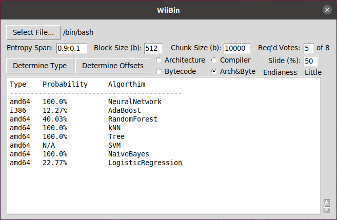
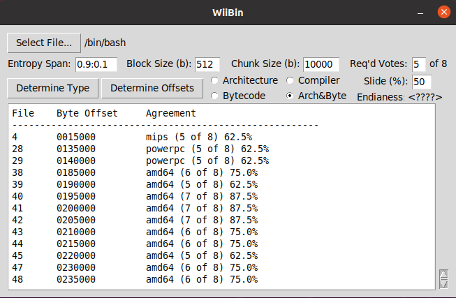

# WiiBin Users Guide

Copyright 2020 Battelle Energy Alliance, LLC, ALL RIGHTS RESERVED

## Note

WiiBin was developed and tested on a Linux system using Python 3.6, yet should be platform agnostic and should also work with MacOS and Windows machines. This has not been thoroughly tested.


## Installation

### Python

WiiBin requires that Python 3.6.x or Higher is installed and accessible through your PATH.

It is recommended to utilize python environments as WiiBin depends on earlier versions of some packages, Pyenv, or Poetry are recommended

### Download Zip

Download and extract the contents of WiiBin.zip into a folder of your choice. 

### Download Via GIT

```bash
git http.sslVerify=false clone --recurse-submodules https://github.com/idaholab/WiiBin.git
cd wiibin
```

### Dependencies 

#### Installing via Poetry

```bash
sudo apt install curl
curl -sSL https://raw.githubusercontent.com/python-poetry/poetry/master/get-poetry.py | python
poetry shell
poetry install
```

#### Installing Dependencies Manually

- numpy (1.18.5) (for numerical processing) 

  ```
  pip3 install numpy==1.18.5
  ```

- pandas (1.0.4) (for data handling) 

  ```
  pip3 install pandas==1.0.4
  ```

- sklearn (0.22.1) (for machine learning)

  ```
  pip3 install sklearn==0.22.1
  ```

- binwalk (tool for walking a binary tree)

  ```
  sudo apt install binwalk
  ```

- matplotlib (3.1.2) (if showPlots variable is true, a graph will be displayed)

  ```
  pip3 install matplotlib==3.1.2
  ```

- tkinter (graphical user interface) (Comes by default on MacOS and Windows python installs)

  ```
  sudo apt install python3-tk
  ```

#### Install via Script (Debian)

```bash
python3 Install.py
```


## Usage

WiiBin is launched from the command line using the following command: 

```bash
python3 WiiBin.py
```

Once launched you are greeted with following interface.


Click *Select File...* to generate a file open dialog and select the binary of interest.

Adjust the default values if desired.

- Entropy Span: The entropy filter to use when generating a byte histogram <Max>:<Min>
- Block Size: The block size in bytes which Binwalk will consider when generating a byte histogram
- Chunk Size: The size in bytes for each portion of the target binary to be split into. 50% overlap is automatically used. Only used when *Determine Offsets* is chosen.
- Req'd Votes: The number of algorithms that must agree on the input binaries architecture in order for results to be output.
- Architecture/Compiler: Selects WiiBin mode of operation.
- Endianess: Displays the calculated endianess of the binary. Note: Endianness field will only be populated when Determine Architecture is used.
- Slide %: The percentage of the current chunk that overlaps the previous chunk.  The larger the percentage the more accurate the data offset measurement
- Percent Compressed/Encrypted:  The percentage of the binary that is above the upper entropy threshold.  This data will be ignored in calculations

Note: Clicking on the field labels in the GUI will display similar helps and definitions.

Click *Determine Type* or *Determine Offsets* to begin processing selected file.

Processing status will be seen in the command line window which originally launched WiiBin.py

Once processing is complete, results will be shown on the WiiBin GUI text field.


*Determine Type* selected and processed:



Predicted Type for each Algorithm is displayed along with the probability of the prediction.  Note: Previous analysis has showed that the NeuralNetwork Algorithm was the most consistently correct and as such is by defaults highlighted in the output as seen above.


*Determine Offsets* selected and processed with an nearly unanimous agreement (7 of 8) required for display:


Byte offsets and type predictions are displayed for the subfiles that resulted in the nearly unanimous agreement on binary architecture.


*Determine Offsets* selected and processed with simple majority agreement required (5 of 8):



Byte offsets and type predictions are displayed for the subfiles that resulted in simple majority agreement (5 or more of 8) on binary architecture.

## Trained Models

Trained models are included (.sav files - SciKit-Learn version 0.22.1). These models are trained on sets of known architecture binaries collected from pre-compiled Debian libraries, as well as C source code compiled with known compilers and optimization settings. These binaries are used to train each model are as follows:

- amd64: 546 - Debian 7.11 Libraries
- armel: 403 - 7.11 Libraries
- armhf: 406 - 7.11 Libraries
- i386: 546 - 7.11 Libraries
- mips: 401 - 7.11 Libraries
- mispel: 404 - 7.11 Libraries
- powerpc: 357 - 7.11 Libraries
- ppc64el: 243 - 8.11 Libraries
- avr: 63 - Subset of Compiled Source from https://github.com/TheAlgorithms/C using avr-gcc
- java: 400 - Java 8 Bytecode
- python27: 207 - Python 2.7 Bytecode
- python35: 170 - Python 3.5 Bytecode
- dotnet5: 510 - .Net Framework Binaries
- gcc: 1320 - Subset of Compiled Source from https://github.com/TheAlgorithms/C
- clang: 792 - Subset of Compiled Source from https://github.com/TheAlgorithms/C

**File structure:**

- Input (Directory for WiiBin internal use)
- Output (Directory for WiiBin internal use)
- OutputTemp (Directory for WiiBin internal use)
- PickledSKLearnModels (Directory containing pickled ML Models) (Pickled with SciKit-Learn version 0.22.1)
  - AdaBoost.sav (Saved AdaBoost Model)
  - kNN.sav (Saved K Nearest Neighbor)
  - LogisticRegression.sav (Saved Logistic Regression Model)
  - NaiveBayes.sav (Saved Naive Bayes Model)
  - NeuralNetwork.sav (Saved Neural Network Model)
  - RandomForest.sav (Saved Random Forest Model)
  - SVM.sav (Saved State Vector Machine Classifier Model)
  - Tree.sav (Saved Tree Model)
- GenerateByteHistogram.py  (Python script to generate CSVs of byte histograms)
- RollingWindowExtractor.py  (Python script to split binary in to overlapping sub parts)
- SingleByteHistogram.py  (Python script to calculate byte histogram of a binary file)
- TrainAndPickleSKLearnModels.py  (Python script which takes in a training data csv and outputs saved sklearn models)
- GenerateTrainingDataCSV.py  (Python script which takes in directory of filename labeled binaries generates training data csvs)
  - Filename Format:  description_type_details    
  - Filename Format:  debian-7.11.0_mipsel_libXRes.so.1.0.0
  - Filename Format:  helloworld_clang_O2
- Install.py (Install script for easier installation of Debian based systems)
- WiiBin.py  (Main WiiBin program with tkinter GUI)
- WiiBin Diagrams.pptx  (PowerPoint to explain some of the WiiBin details and design decisions)
- images (Screenshots to support Readme.md)
- Readme.md (This file)


## Change Log

##### Version 1.7

- Added warning popup if more than 33% compressed or encrypted

##### Version 1.6

- Added simple progress percentage for Detect Arch
- Added Check for ZeroByte files

##### Version 1.5

- Added Calculation of the percentage of the selected file that is above the upper entropy threshold (compressed or encrypted)

##### Version 1.4

- Added support for AVR architectures
- Retrained from fewer dotNet binaries
- Split architecture and bytecode detection

##### Version 1.3

- Added Mode Selection (Architecture/Compiler)
- Added Additional Startup Notes
- Wording modifications

##### Version 1.2

- Buffered File with 0x00's (Appended and Prepended) to aide in sliding window usage
- Offset measured from center of sliding window (Chunk Size)
- Adjustable slide % (Set the amount of overlap that is included with the sliding windows: 10%=90% Overlap)
- Added .Net Bytecode Detection
- Added Startup Notes
- Additional Error checking

##### Version 1.1

- Added Java Bytecode Detection
- Added Python Bytecode Detection
- Added tooltip helps
- Additional Error checking

##### Version 1.0

- Original Release


## Security Review

Bandit security code analysis results: https://bandit.readthedocs.io/en/latest/

- B110: Try, Except, Pass detected.
- B301: Pickle and modules that wrap it can be unsafe when used to deserialize untrusted data, possible security issue.
- B403: Consider possible security implications associated with pickle module.
- B404: Consider possible security implications associated with subprocess module.
- B602: subprocess call with shell=True identified, security issue.
- B603: subprocess call - check for execution of untrusted input.
- B605: Starting a process with a shell, possible injection detected, security issue.
- B607: Starting a process with a partial executable path

With proper code rewrite most if not all of these security issues can be resolved.  These are not considered critical as WiiBin is considered proof of concept code.